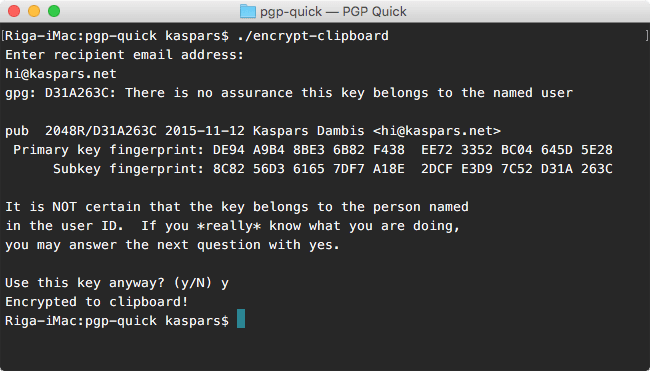

# PGP Encrypt, Decrypt, Sign and Verify Clipboard

A set of bash scripts to simplify the encryption, decryption, signing and verification of any content you have copied to the clipboard. Automatically searches the [pgp.mit.edu keyserver](https://pgp.mit.edu/) for unknown recipients during encryption.

## Requirements

Download and install [GnuPG for OS X](http://sourceforge.net/p/gpgosx/docu/Download/) or using [Homebrew](http://brew.sh/): 

	$ brew install gpg

## Install

	$ git clone https://github.com/kasparsd/pgp-quick.git

## Usage

### Encryption

Simply copy the text you want to encrypt and double click the `encrypt-clipboard` file or run it from the terminal:

	$ ./encrypt-clipboard

and it will prompt you to enter the recipient email address:

	$ ./encrypt-clipboard
	Enter recipient email address:
	hi@kaspars.net

In case the public key of the recipient is not found in your local keyring, it will search the [pgp.mit.edu](https://pgp.mit.edu/) keyserver and offer you to select from the keys found:

	gpg: D31A263C: There is no assurance this key belongs to the named user

	pub  2048R/D31A263C 2015-11-12 Kaspars Dambis <hi@kaspars.net>
	 Primary key fingerprint: DE94 A9B4 8BE3 6B82 F438  EE72 3352 BC04 645D 5E28
	      Subkey fingerprint: 8C82 56D3 6165 7DF7 A18E  2DCF E3D9 7C52 D31A 263C

	It is NOT certain that the key belongs to the person named
	in the user ID.  If you *really* know what you are doing,
	you may answer the next question with yes.

	Use this key anyway? (y/N)

Please take extra care when selecting the key by ensuring the [correct fingerprint](https://en.wikipedia.org/wiki/Public_key_fingerprint). For example, the [about page on kaspars.net](http://kaspars.net/about) lists `DE94 A9B4 8BE3 6B82 F438  EE72 3352 BC04 645D 5E28` as the fingerprint of my public key which indeed matches the one found by the script above.

### Signing and Verification

For example, here is a message that I would like to sign:

	PGP Quick can be found at https://github.com/kasparsd/pgp-quick

so I select and copy that string and run (or click)

	$ ./sign-clipboard

which signs the message and stores it into clipboard:

	-----BEGIN PGP SIGNED MESSAGE-----
	Hash: SHA1

	PGP Quick can be found at https://github.com/kasparsd/pgp-quick
	-----BEGIN PGP SIGNATURE-----
	Version: GnuPG v1

	iQEcBAEBAgAGBQJWUQPMAAoJEDNSvARkXV4o0dwH/3DTfgoO6UuDrhkRSGoyNdI6
	c38psk+9397vZBptsnBta0O/FBhunLReIVQI1Ab3pOkiHir7Qj8ktX1s70Ftcv9x
	7lZwtb+ECLmwhS1FUvNAh482vGyN/VuBnJlGVAbEUW+PQ/AifxLsFHjpw7duhxnu
	3SYyb7ZnR6n3vcNuWFVBqnW/C7zofg06Q5GHARmnEBELdEggSUB6sByYF70c0rDI
	ChCsxRgjY9JbS4nzM7orUY1NoGIIfGqtMDwsxh01S3GQyRvG5FcxuoAZ1zGx6TEV
	o1KVNbSD2gAJtD4V5bpZBTghF8/bSopssUAgMjhXF+J6h6040mIcw/8M6N8+q+0=
	=zeBM
	-----END PGP SIGNATURE-----

Now everyone can verify that it was written by me:

	$ ./verify-clipboard
	gpg: Signature made Sun Nov 22 01:52:44 2015 EET using RSA key ID 645D5E28
	gpg: Good signature from "Kaspars Dambis <kaspars@damb.is>"
